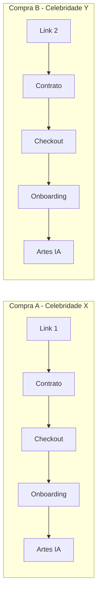
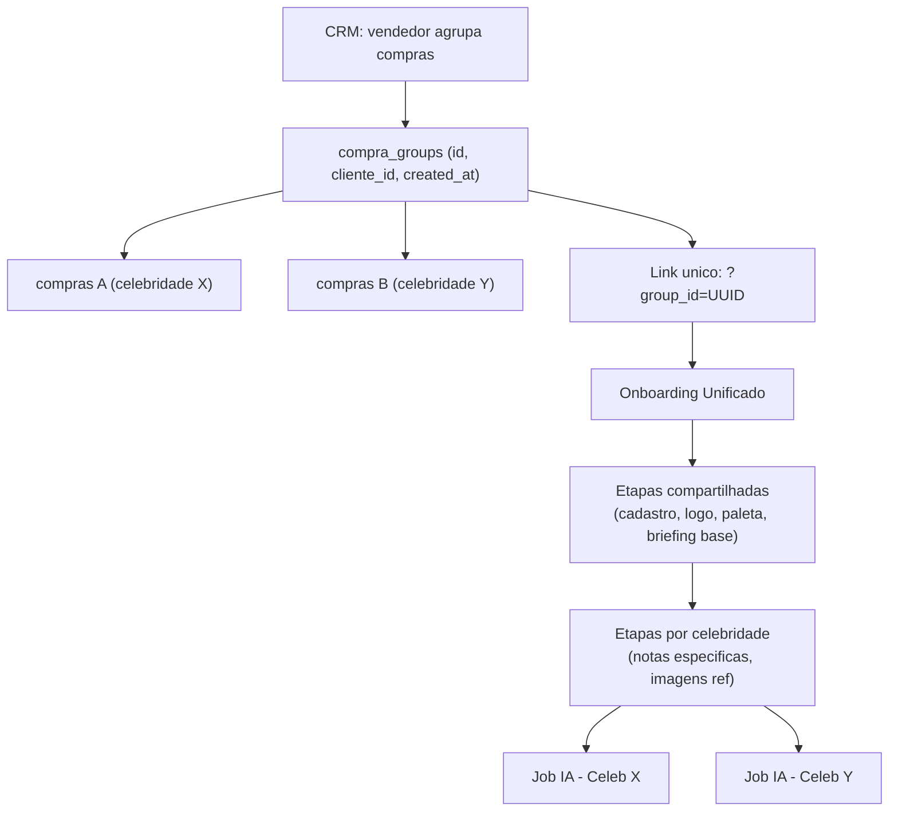
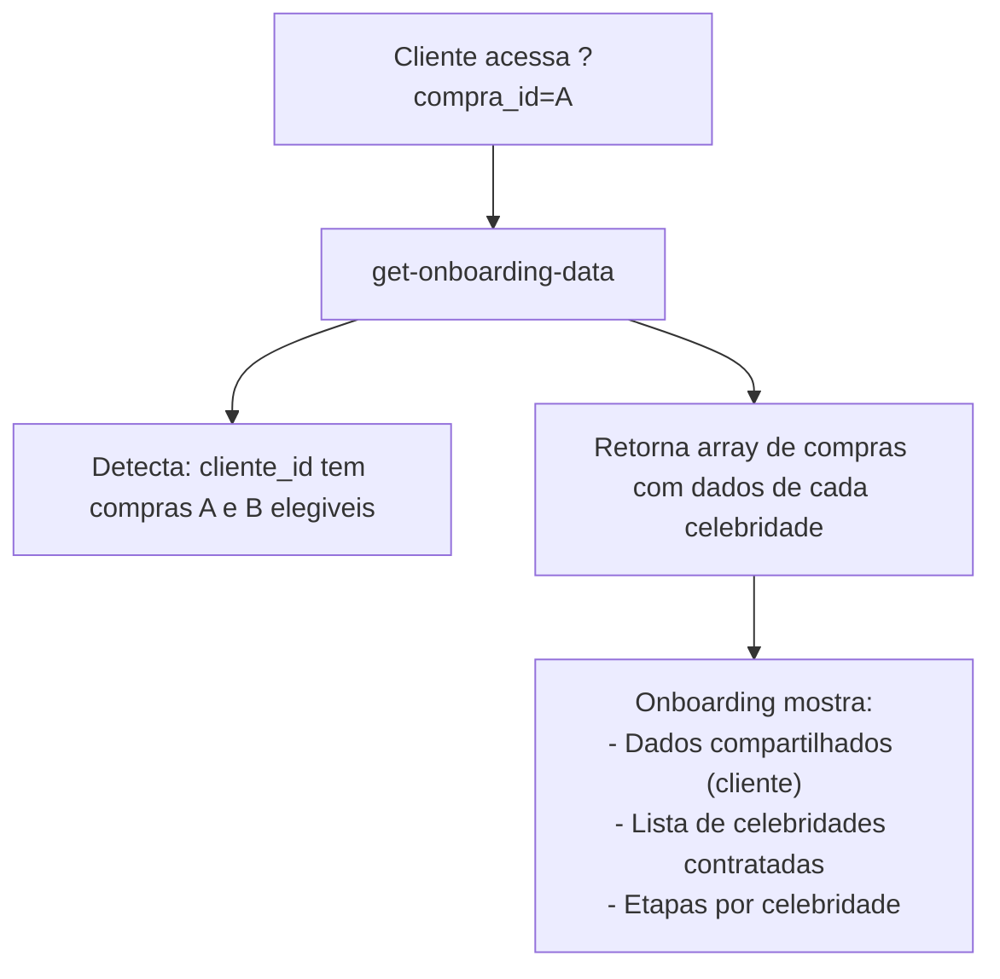
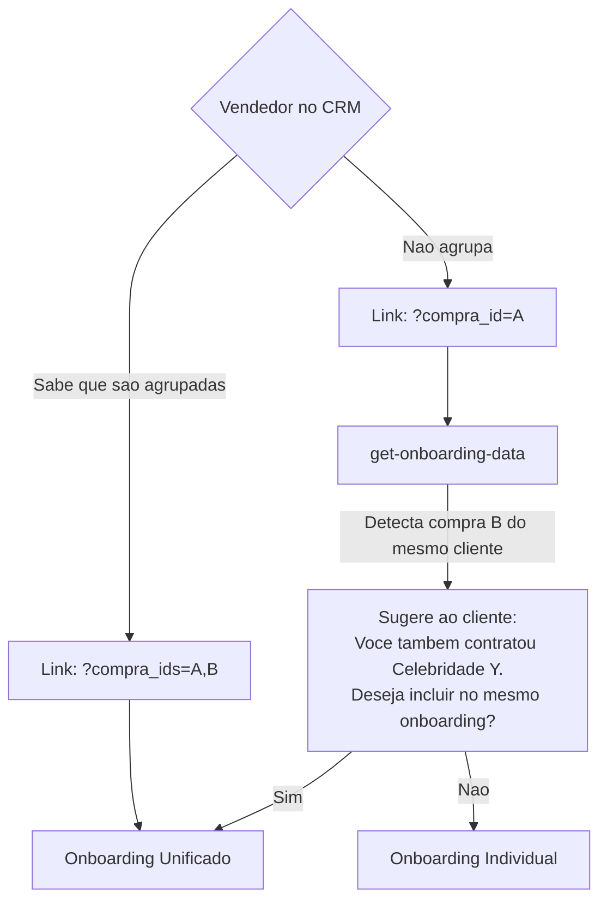

# Arquitetura: Onboarding Unificado para Multiplas Celebridades

## Situacao Atual

Cada compra (`compra_id`) gera um fluxo independente e isolado:



**Pontos de acoplamento ao `compra_id` unico:**
- URL: `?compra_id=<UUID>` (singular)
- `OnboardingContext`: estado para 1 compra (`clientName`, `celebName`, `pacote` sao singulares)
- `onboarding_identity`: UNIQUE por `compra_id` (1:1) -- cada compra tem sua identidade visual
- `onboarding_briefings`: UNIQUE por `compra_id` (1:1) -- cada compra tem seu briefing
- `ai_campaign_jobs`: N:1 por `compra_id` -- jobs de arte por compra
- Storage: paths em `{compra_id}/logo.ext`

**O que ja e naturalmente per-compra (e deveria continuar sendo):**
- Celebridade, regiao, vigencia, pacote, segmento
- Jobs de geracao de arte (prompt usa dados da celebridade especifica)
- Assets gerados

**O que e redundante quando o cliente e o mesmo:**
- Dados cadastrais do cliente (nome, CNPJ, endereco)
- Logo da marca
- Paleta de cores e tipografia
- Parte do briefing (tom de voz, posicionamento, produto)
- Preencher o onboarding N vezes

---

## Abordagem A: "Grupo de Compras" (Nova Entidade no Banco)

### Conceito

Criar uma entidade `compra_group` que agrupa N compras do mesmo cliente numa mesma jornada comercial. O onboarding recebe o grupo e apresenta uma experiencia unificada.



### Modelo de dados

```sql
CREATE TABLE compra_groups (
  id uuid PRIMARY KEY DEFAULT gen_random_uuid(),
  cliente_id uuid NOT NULL REFERENCES clientes(id),
  created_at timestamptz DEFAULT now()
);

ALTER TABLE compras ADD COLUMN group_id uuid REFERENCES compra_groups(id);
```

Opcionalmente, uma `onboarding_group_identity` para dados compartilhados (logo, paleta, fonte), enquanto `onboarding_identity` por compra guarda apenas dados especificos da celebridade (notas, imagens de referencia).

### Pros
- Modelo limpo e normalizado
- Rastreabilidade total: cada compra mantem seu Purchase ID, contrato, checkout
- O grupo e explicito no banco -- queries simples
- Escala para 3+ celebridades naturalmente
- Retrocompativel: compras sem grupo continuam funcionando (group_id nullable)

### Contras
- Requer mudanca no CRM (vendedor precisa criar/associar grupo)
- Exige mudanca no checkout (link unificado ou agrupamento)
- Mudanca significativa no frontend (OnboardingContext precisa lidar com N compras)
- Maior esforco de implementacao

---

## Abordagem B: "Deteccao Automatica por Cliente" (Sem Nova Entidade)

### Conceito

Nao criar entidade nova. Quando o cliente acessa o onboarding via qualquer `compra_id`, o backend detecta que o mesmo `cliente_id` tem outras compras elegiveis e retorna todas. O frontend apresenta uma experiencia unificada.



### Mudancas necessarias

- `get-onboarding-data`: alem de buscar a compra do `compra_id`, buscar todas as compras elegiveis do mesmo `cliente_id`
- Frontend: exibir lista de celebridades e permitir preencher dados compartilhados 1x + dados por celebridade
- `save-onboarding-identity`: chamado N vezes (1 por compra), mas logo/paleta/fonte podem ser copiados

### Pros
- Zero mudanca no CRM e no checkout (fluxo existente continua igual)
- Zero mudanca no banco (sem migrations)
- O cliente entra por qualquer link e "descobre" as outras compras automaticamente
- Implementacao mais leve (backend + frontend)

### Contras
- Deteccao pode ser imprecisa (e se o cliente tem compras de meses atras?)
  - Mitigacao: filtro por janela temporal (ex: compras dos ultimos 30 dias)
- Nao ha vinculo explicito no banco -- a relacao e inferida
- Pode confundir: cliente entra pelo link da compra A e ve a compra B que ele nao esperava
- Se o cliente fizer compras em momentos diferentes, o "auto-agrupar" pode errar
- Sem controle do vendedor sobre o que e agrupado

---

## Abordagem C: "Hibrida" (Link Composto + Fallback Automatico)

### Conceito

Combina A e B. O CRM pode gerar um link composto quando o vendedor sabe que sao compras agrupadas, mas o sistema tambem detecta automaticamente compras do mesmo cliente como fallback.



### Modelo de dados (leve)

Nao exige nova tabela obrigatoriamente. Pode funcionar com:

1. **Opcao minima:** parametro de URL `?compra_ids=A,B` -- sem mudanca no banco
2. **Opcao com persistencia:** coluna `group_id` em `compras` (como na Abordagem A), preenchida opcionalmente pelo CRM

### Pros
- Flexivel: funciona com ou sem o CRM gerando link composto
- O cliente tem controle: pode aceitar ou recusar o agrupamento
- Menos risco de agrupar compras erradas (consentimento explicito)
- Implementacao incremental: comeca com deteccao automatica, depois o CRM gera links compostos

### Contras
- UX mais complexa (tela de "descoberta" de compras extras)
- Duas codepaths no frontend (link composto vs link simples + sugestao)
- Precisa definir regras de deteccao (janela temporal, status, etc.)

---

## Comparativo

| Criterio | A: Grupo no Banco | B: Deteccao Auto | C: Hibrida |
|----------|-------------------|-------------------|------------|
| Mudanca no CRM | Sim (criar grupo) | Nao | Opcional |
| Mudanca no banco | Sim (nova tabela) | Nao | Opcional |
| Mudanca no frontend | Grande | Media | Media-Grande |
| Precisao do agrupamento | Alta (explicito) | Media (inferido) | Alta (consentido) |
| Retrocompatibilidade | Total (group_id nullable) | Total | Total |
| Esforco de implementacao | Alto | Medio | Medio-Alto |
| Escala para 3+ celebs | Natural | Natural | Natural |
| Risco de agrupar errado | Zero | Medio | Baixo |

---

## Recomendacao

**Abordagem C (Hibrida)** oferece o melhor equilibrio:

1. **Fase 1 (rapida):** Implementar deteccao automatica no `get-onboarding-data` + UX de sugestao no frontend. Zero mudanca no CRM/banco. O cliente que entra com `?compra_id=A` e tem outra compra elegivel do mesmo `cliente_id` recebe a opcao de unificar.

2. **Fase 2 (evolucao):** Quando o CRM estiver pronto, suportar `?compra_ids=A,B` no link e opcionalmente persistir `group_id` em `compras`.

Isso resolve o problema imediato sem depender de mudancas no CRM, e abre caminho para a solucao completa.

---

## Decisoes em Aberto

Independente da abordagem escolhida, precisamos definir:

1. **O que e compartilhado vs por celebridade no onboarding?**
   - Compartilhado: logo, paleta, fonte, dados cadastrais, briefing base
   - Por celebridade: notas de campanha, imagens de referencia, production path
   
2. **O briefing e 1 por grupo ou 1 por compra?**
   - Se o tom de voz e o mesmo, 1 briefing base duplicado para cada compra faz sentido
   - Se o produto muda por celebridade, precisa de briefing individual

3. **E se o cliente quer production paths diferentes por celebridade?**
   - Ex: standard para celeb A, hybrid para celeb B

4. **Janela temporal para deteccao automatica (Abordagem B/C):**
   - Compras do mesmo cliente nos ultimos 7/14/30 dias? Ou qualquer compra elegivel sem onboarding completo?
