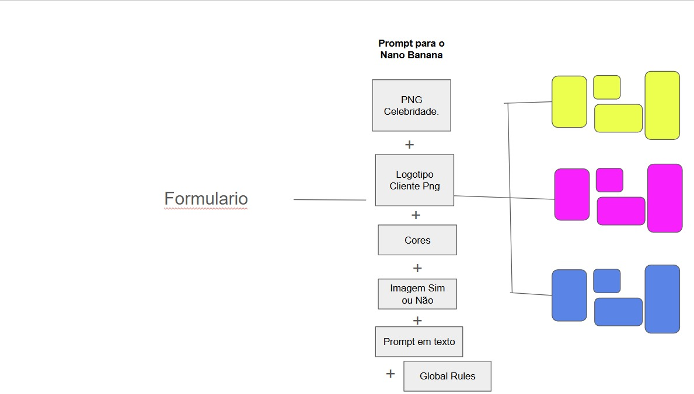

## Modelo que vamos usar
gemini-3-pro-image-preview

## Contexto que vamos utilizar para gerar as imagens
O prompt para o Nano Banana é composto de:

1) PNG da celebridade
2) Logotipo do cliente em png
3) Paleta de cores
4) Imagem de produto, ambiente ou elemento (opcional)
5) Prompt dinamico com os dados do cliente
6) Global Rules!

## Tabela de grupos
| Categoria     | 🖤 Moderna                                 | 🤍 Clean                                      | 🟡 Retail                                  |
|--------------|--------------------------------------------|-----------------------------------------------|--------------------------------------------|
| Fundo        | Preto / escuro                             | Branco puro                                  | Cor sólida da marca                        |
| Celebridade  | Herói 70–80% do frame, cinematográfico     | Foto limpa flutuando no branco, canto direito | Cut-out em pé, lado direito, quebra a moldura |
| Layout       | Assimétrico, foto domina, texto na base    | Split editorial 30/70 com coluna de texto     | Geométrico duro, blocos e badges           |
| Tipografia   | Ultra-bold condensed, impactante           | Light/regular serif ou sans, com muito espaço | All-caps condensed, máximo contraste       |
| Referência   | Nike / pôster de filme                     | Vogue / anúncio Apple                         | Casas Bahia / Magazine Luiza               |

